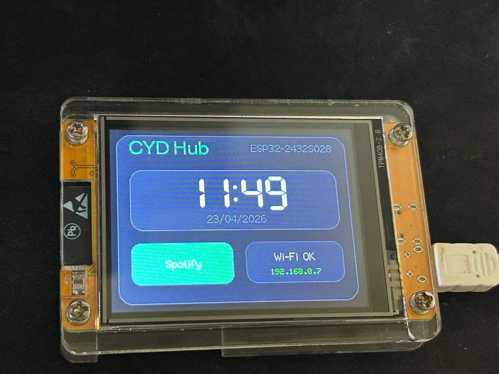
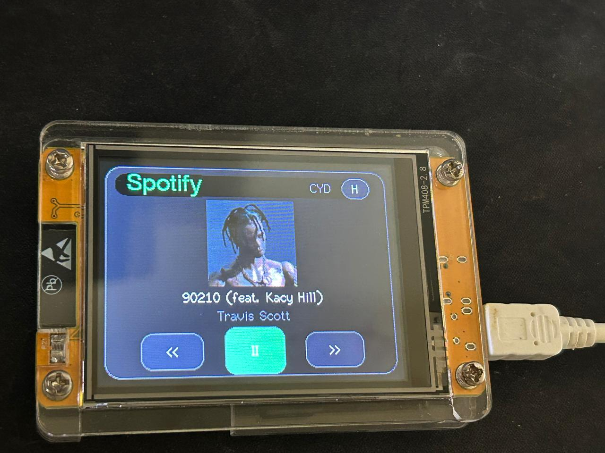

<<<<<<< HEAD
# cyd-spotify-dashboard
=======
# CYD Spotify Hub

Interface touch para o **ESP32-2432S028**, também conhecido como **ESP32 CYD / Cheap Yellow Display**, com dashboard inicial e player Spotify integrado.

O projeto foi feito para a tela ILI9341 320x240 em modo paisagem e touch XPT2046 do CYD.





## Recursos

- Dashboard/Home com relógio grande, data, status de Wi-Fi, IP local e botão para abrir o Spotify.
- Player Spotify com capa do álbum, nome da música, artista e controles touch.
- Botões de voltar faixa, play/pause e avançar faixa.
- Botão Home no player para voltar ao dashboard.
- Layout otimizado para o ESP32-2432S028 em 320x240.
- Touch via driver CYD/XPT2046 por polling.
- Estrutura preparada para adicionar novas telas/apps no futuro.

## Hardware

- ESP32-2432S028 / ESP32 CYD / Cheap Yellow Display.
- Display ILI9341 2.8" 320x240.
- Touch XPT2046.
- USB serial reconhecido como `/dev/ttyUSB0` ou semelhante.

## Requisitos

- PlatformIO.
- Conta Spotify Premium para controlar reprodução.
- App criado no Spotify Developer Dashboard.
- Redirect URI no app Spotify:

```text
http://127.0.0.1:8888/callback
```

Escopos usados:

```text
user-read-currently-playing user-read-playback-state user-modify-playback-state
```

## Configuração Segura

Este repositório **não deve conter chaves reais**. O arquivo real de credenciais é ignorado pelo Git:

```text
include/secrets.h
```

Crie o arquivo local a partir do exemplo:

```bash
cp include/secrets_example.h include/secrets.h
```

Preencha:

```cpp
#define WIFI_SSID "YOUR_WIFI_NAME"
#define WIFI_PASSWORD "YOUR_WIFI_PASSWORD"

#define SPOTIFY_CLIENT_ID "YOUR_SPOTIFY_CLIENT_ID"
#define SPOTIFY_CLIENT_SECRET "YOUR_SPOTIFY_CLIENT_SECRET"
#define SPOTIFY_REFRESH_TOKEN "YOUR_SPOTIFY_REFRESH_TOKEN"
```

## Gerar Refresh Token

Com o Redirect URI configurado no Spotify Dashboard, rode:

```bash
python3 tools/get_spotify_refresh_token.py "SEU_CLIENT_ID" "SEU_CLIENT_SECRET"
```

Abra a URL exibida no navegador, autorize o app e copie o `SPOTIFY_REFRESH_TOKEN` gerado para `include/secrets.h`.

## Build e Upload

Instale dependências e compile com PlatformIO:

```bash
pio run
```

Para gravar no ESP32:

```bash
pio run -t upload --upload-port /dev/ttyUSB0
```

Se estiver usando o ambiente virtual/local deste projeto:

```bash
PLATFORMIO_CORE_DIR=/home/lucas/esp32/.platformio /home/lucas/esp32/.venv/bin/pio run -t upload --upload-port /dev/ttyUSB0
```

Monitor serial:

```bash
pio device monitor --port /dev/ttyUSB0
```

## WSL e USB

Se estiver no WSL e `/dev/ttyUSB0` não existir, anexe o USB pelo Windows:

```powershell
usbipd list
usbipd bind --busid SEU-BUSID
usbipd attach --wsl --busid SEU-BUSID
```

Depois confira no WSL:

```bash
ls /dev/ttyUSB* /dev/ttyACM*
```

## Estrutura

```text
include/
  CYD28_TouchscreenR.h     # Driver touch CYD/XPT2046
  secrets_example.h        # Modelo seguro de credenciais

src/
  CYD28_TouchscreenR.cpp   # Implementação touch
  main.cpp                 # UI, Home, Player e integração Spotify

tools/
  get_spotify_refresh_token.py

docs/images/
  home.jpeg
  spotify.jpeg
```

## Segurança

- Nunca publique `include/secrets.h`.
- Se alguma chave/token já tiver sido exposta, revogue no Spotify Developer Dashboard e gere novas credenciais.
- O firmware usa `client.setInsecure()` para simplificar HTTPS no ESP32. Isso é aceitável para protótipo/local, mas não é ideal para produto final.
- O `SPOTIFY_CLIENT_SECRET` fica gravado no ESP32. Para um projeto público/produção, o ideal é usar um backend intermediário para guardar o secret e entregar tokens temporários ao dispositivo.

## Próximos Passos

- Adicionar novas telas/apps no dashboard.
- Criar tela de configurações.
- Melhorar cache da capa do álbum.
- Adicionar ícones desenhados para os apps.
- Migrar credenciais Spotify para backend seguro.
>>>>>>> 18c20e9 (Initial CYD Spotify HUB)
